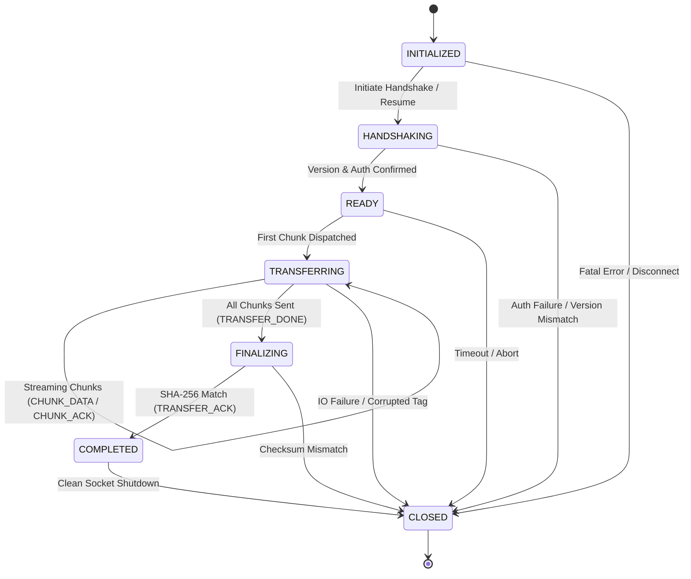

# AirSocket

[](https://jdk.java.net/21/)
[](https://maven.apache.org/)
[](.github/workflows/ci.yml)
[](src/test/java/com/airsocket/)
[](checkstyle.xml)
[](LICENSE)

**AirSocket** is a high-performance, resilient, zero-runtime-dependency peer-to-peer (P2P) file transfer tool and low-level networking laboratory built entirely on the Java Standard Library (`java.base`, Java 21+).

AirSocket enables authenticated, encrypted, and resumable file streaming across local area networks without external cloud servers, centralized relays, or third-party libraries. It also serves as an interactive systems lab for studying socket buffer scaling, TCP window dynamics, Nagle's algorithm (`TCP_NODELAY`), authenticated encryption (AES-256-GCM), Project Loom virtual threads, and state-machine-governed protocol design.

---

## Architectural Highlights

AirSocket demonstrates core networking, cryptography, and operating systems principles directly using `java.base`:

* **Zero Third-Party Runtime Dependencies:** 100% standard library. No Netty, no Jackson, no SLF4J, no BouncyCastle. Distributed as a self-contained executable fat JAR.
* **Zero-Configuration LAN Discovery:** Uses UDP broadcast (`42069/UDP`) to identify local peers and calculate network round-trip time (RTT) without mDNS or external signaling servers.
* **Strict Binary Framing Protocol (V4):** Streams data using a fixed 28-byte binary header with monotonic sequence numbering, 128-bit UUID transfer IDs, and typed frame headers.
* **Deterministic Finite State Machine:** Governs transfer lifecycles (`INITIALIZED` &rarr; `HANDSHAKING` &rarr; `READY` &rarr; `TRANSFERRING` &rarr; `FINALIZING` &rarr; `COMPLETED` &rarr; `CLOSED`), immediately terminating any out-of-order session states.
* **Authenticated Encryption (AEAD):** End-to-end file encryption using **AES-256-GCM** with key derivation via **PBKDF2WithHmacSHA256** (65,536 iterations). Validates ciphertext integrity with 128-bit GCM authentication tags, automatically purging tampered files.
* **Stateful Chunk Tracking & Resume:** Persists byte offsets and session metadata in `.part` and `.meta` files. Interrupted transfers automatically resume from the last transmitted byte using exponential backoff retries.
* **Project Loom Concurrency:** Leverages Java 21 Virtual Threads (`Thread.ofVirtual()`) for high-throughput, low-memory concurrent peer streaming without thread pool exhaustion.
* **Built-in Systems & Profiling Lab:** Includes 10 automated benchmark suites to measure TCP buffer scaling, kernel latency, memory allocations, and simulated packet loss.
* **Structured Observability:** Custom zero-dependency logging engine with MDC Transfer ID correlation, log level hierarchy (`TRACE`, `DEBUG`, `INFO`, `WARN`, `ERROR`), and terminal ANSI styling.

---

## Technical Performance & Benchmarks

AirSocket benchmarks demonstrate how application-level write buffer alignment and socket tuning overcome TCP delayed acknowledgment and Nagle's algorithm latency:

* **Default 4 KiB Buffer:** `163.6 Mbps`
* **Optimized 512 KiB Buffer:** `886.0 Mbps` (**5.41x throughput improvement**, saturating physical Gigabit LAN)
* **Real-World File Transfer:** Transferred a 25 MB payload in approximately `0.3 seconds` at an average throughput of **89.3 MB/s (714.4 Mbps)**.
* **Loopback Memory-to-Memory Transfer:** Achieved memory-to-memory speeds up to **16.3 Gbps** on local interfaces.

---

## CLI Reference & Usage

### Command Summary

```bash
java -jar target/airsocket-1.0.0.jar [command] [options]
```

| Command | Description |
|---|---|
| `discover` | Scans the local network for active AirSocket peers via UDP broadcast |
| `send <file>` | Streams a file to a peer (via direct IP or first discovered peer) |
| `receive` | Listens for incoming transfers and saves received files to disk |
| `benchmark` | Runs socket buffer tuning experiments and throughput analysis |

---

### Global Options

| Option | Argument | Description | Default |
|---|---|---|---|
| `--to` | `<ip>` | Target peer IP address (for `send` or `benchmark`) | *Auto-discover* |
| `--port` | `<n>` | Port used for TCP transfers and server binding | `9000` |
| `--output-dir`, `-o` | `<dir>` | Target destination directory for received files | `.` (current dir) |
| `--encrypt` | *None* | Enables AES-256-GCM authenticated encryption (prompts for passphrase) | *Disabled* |
| `--resume` | *None* | Resumes a previously interrupted transfer from last confirmed byte offset | *Disabled* |
| `--timeout` | `<ms>` | Socket connect and read timeout in milliseconds | `15000` |
| `--retries` | `<n>` | Maximum reconnection retry attempts for interrupted transfers | `3` (with `--resume`) |
| `--protocol-version`| `<v>` | Target protocol version to negotiate (`1` to `4`) | `4` |
| `--no-progress` | *None* | Disables interactive terminal progress bar output | *Disabled* |
| `--log-level` | `<level>`| Minimum logging threshold (`TRACE`, `DEBUG`, `INFO`, `WARN`, `ERROR`) | `INFO` |
| `--debug` | *None* | Shortcut to enable `DEBUG` logging | *Disabled* |
| `--trace` | *None* | Shortcut to enable `TRACE` logging | *Disabled* |
| `--help`, `-h` | *None* | Displays command-line help and usage examples | *Disabled* |

---

### Benchmark Options

| Option | Argument | Description | Default |
|---|---|---|---|
| `--suite` | `<name>` | Benchmark suite: `all`, `app-vs-tcp`, `nodelay`, `rcvbuf`, `sweep`, `stats`, `realfile`, `encrypt-overhead`, `profile`, `netem` | `all` |
| `--runs` | `<n>` | Number of measurement iterations per parameter | `3` |
| `--size-mb` | `<n>` | Size of generated in-memory payload in megabytes | `25` |
| `--file` | `<path>` | Path to real disk file (used by `realfile` suite) | *None* |
| `--server` | *None* | Starts AirSocket in standalone benchmark server mode | *Disabled* |
| `--buf-sizes` | `<list>` | Comma-separated socket buffer sizes for legacy benchmark | `8192,16384,32768,65536,131072,262144` |

---

## Step-by-Step Usage Examples

### 1. Discover Peers on the LAN
Broadcasts a UDP discovery ping to identify running AirSocket instances:
```bash
java -jar target/airsocket-1.0.0.jar discover
```
*Output:*
```
Scanning LAN...
  192.168.1.42     node-charlie     (RTT: 1.2ms)
  192.168.1.75     nas-backup       (RTT: 2.4ms)
```

### 2. Start Receiver Mode
Listens for incoming files on port `9000` and saves them to the `./downloads` folder:
```bash
java -jar target/airsocket-1.0.0.jar receive --port 9000 -o ./downloads
```

To enable resumable transfer support for interrupted transfers:
```bash
java -jar target/airsocket-1.0.0.jar receive --port 9000 --resume -o ./downloads
```

### 3. Send a File (Direct IP)
Sends a file directly to a specific target host:
```bash
java -jar target/airsocket-1.0.0.jar send dataset.tar.gz --to 192.168.1.42 --port 9000
```

### 4. Send a File (Auto-Discovery)
When `--to` is omitted, AirSocket scans the LAN and connects to the first discovered peer:
```bash
java -jar target/airsocket-1.0.0.jar send dataset.tar.gz
```

### 5. Encrypted File Transfer
Encrypts the payload in transit with AES-256-GCM. Prompts both sender and receiver for matching passphrases:
```bash
# Receiver
java -jar target/airsocket-1.0.0.jar receive --encrypt

# Sender
java -jar target/airsocket-1.0.0.jar send confidential.pdf --to 192.168.1.42 --encrypt
```

### 6. Resuming Interrupted Transfers
If a transfer is terminated by network disruption or process termination, re-run with `--resume` to continue from the last written byte:
```bash
# Receiver
java -jar target/airsocket-1.0.0.jar receive --resume

# Sender
java -jar target/airsocket-1.0.0.jar send largefile.iso --to 192.168.1.42 --resume --retries 5
```

### 7. Structured Debug & Trace Logging
Inspect binary frame exchanges, state machine transitions, and thread assignments:
```bash
java -jar target/airsocket-1.0.0.jar send archive.zip --to 192.168.1.42 --debug
```

---

## Networking & Performance Laboratory

AirSocket includes a comprehensive benchmarking engine that tests TCP performance variables and simulates degraded network topologies:

```bash
# 1. Application buffer vs TCP socket buffer matrix
java -jar target/airsocket-1.0.0.jar benchmark --suite app-vs-tcp --runs 3 --size-mb 25

# 2. TCP_NODELAY A/B testing (evaluates Nagle's algorithm)
java -jar target/airsocket-1.0.0.jar benchmark --suite nodelay --runs 3

# 3. Receive buffer scaling (SO_RCVBUF sweep)
java -jar target/airsocket-1.0.0.jar benchmark --suite rcvbuf

# 4. Power-of-two buffer scaling sweep (4 KiB to 4 MiB)
java -jar target/airsocket-1.0.0.jar benchmark --suite sweep --runs 5

# 5. Statistical distribution analysis (Mean, Median, StdDev, CV%, P95, P99)
java -jar target/airsocket-1.0.0.jar benchmark --suite stats --runs 10 --size-mb 50

# 6. Disk I/O vs in-memory streaming comparison
java -jar target/airsocket-1.0.0.jar benchmark --suite realfile --file large_disk_image.iso

# 7. AES-256-GCM cryptographic overhead measurement
java -jar target/airsocket-1.0.0.jar benchmark --suite encrypt-overhead --size-mb 25

# 8. CPU, memory heap, and GC pause profiling
java -jar target/airsocket-1.0.0.jar benchmark --suite profile --size-mb 50

# 9. In-process network simulation (latency, jitter, packet loss)
java -jar target/airsocket-1.0.0.jar benchmark --suite netem --size-mb 5

# 10. Run entire battery of benchmark suites
java -jar target/airsocket-1.0.0.jar benchmark --suite all
```

### Kernel-Level Network Emulation (`scripts/netem.sh`)
For real Linux kernel packet simulation using `tc` (Traffic Control) and `netem`:
```bash
# Apply 25ms delay, 5ms jitter, 1% packet loss, and 100 Mbps rate limit on loopback
sudo ./scripts/netem.sh apply --dev lo --delay 25ms --jitter 5ms --loss 1% --rate 100mbit

# View active rules
sudo ./scripts/netem.sh status --dev lo

# Reset simulation rules
sudo ./scripts/netem.sh reset --dev lo
```

---

## Wire Protocol & Binary Framing (V4)

AirSocket V4 streams data over raw TCP using a fixed 28-byte binary header followed by a variable-length payload:

```
 0                   1                   2                   3
 0 1 2 3 4 5 6 7 8 9 0 1 2 3 4 5 6 7 8 9 0 1 2 3 4 5 6 7 8 9 0 1
+-+-+-+-+-+-+-+-+-+-+-+-+-+-+-+-+-+-+-+-+-+-+-+-+-+-+-+-+-+-+-+-+
|                       Magic: 0x41525354 ("ARST")              |
+-+-+-+-+-+-+-+-+-+-+-+-+-+-+-+-+-+-+-+-+-+-+-+-+-+-+-+-+-+-+-+-+
|       Protocol Version        |          Frame Type           |
+-+-+-+-+-+-+-+-+-+-+-+-+-+-+-+-+-+-+-+-+-+-+-+-+-+-+-+-+-+-+-+-+
|                                                               |
+                    Sequence Number (64-bit)                   +
|                                                               |
+-+-+-+-+-+-+-+-+-+-+-+-+-+-+-+-+-+-+-+-+-+-+-+-+-+-+-+-+-+-+-+-+
|                                                               |
+                     Payload Length (64-bit)                   +
|                                                               |
+-+-+-+-+-+-+-+-+-+-+-+-+-+-+-+-+-+-+-+-+-+-+-+-+-+-+-+-+-+-+-+-+
|                         Flags (32-bit)                        |
+-+-+-+-+-+-+-+-+-+-+-+-+-+-+-+-+-+-+-+-+-+-+-+-+-+-+-+-+-+-+-+-+
|                       Payload Data (Variable)                 |
+-+-+-+-+-+-+-+-+-+-+-+-+-+-+-+-+-+-+-+-+-+-+-+-+-+-+-+-+-+-+-+-+
```

### Frame Types

| Type Code | Constant | Role |
|---|---|---|
| `0x0001` | `HANDSHAKE_INIT` | Handshake initiation carrying Transfer ID, filename, size, salt, and auth token |
| `0x0002` | `HANDSHAKE_ACK` | Handshake response confirming negotiated version and start offset |
| `0x0003` | `RESUME_REQ` | Reconnection request carrying Transfer ID and expected size |
| `0x0004` | `RESUME_ACK` | Resume confirmation returning accepted byte offset |
| `0x0005` | `CHUNK_DATA` | Streamed data chunk (plaintext or AES-256-GCM ciphertext) |
| `0x0006` | `CHUNK_ACK` | Sliding window chunk acknowledgment |
| `0x0007` | `TRANSFER_DONE` | Final frame carrying 32-byte SHA-256 integrity checksum |
| `0x0008` | `TRANSFER_ACK` | Confirmation of checksum verification and final disk flush |
| `0x0009` | `ERROR` | Typed protocol error signaling with diagnostic message |
| `0x000A` | `PING` | Liveness heartbeat request |
| `0x000B` | `PONG` | Liveness heartbeat reply |

### Typed Error Codes (`ErrorCode`)

| Code | Constant | Semantic Meaning | Retryable? |
|---|---|---|---|
| `0x01` | `AUTH_FAILED` | Passphrase mismatch or corrupt AEAD auth tag | No |
| `0x02` | `PROTOCOL_MISMATCH` | Incompatible client/server protocol versions | No |
| `0x03` | `ILLEGAL_STATE` | Frame received out of state machine sequence | No |
| `0x04` | `CHECKSUM_MISMATCH` | SHA-256 verification failed after transmission | Yes |
| `0x05` | `INSUFFICIENT_SPACE`| Destination disk volume lacks required free space | No |
| `0x06` | `PATH_TRAVERSAL` | Filename contains illegal `..` or path escape characters | No |
| `0x07` | `CORRUPTED_FRAME` | Invalid header magic, bad flags, or length overflow | Yes |
| `0x08` | `TRANSFER_REJECTED`| Receiver configuration rejected session (e.g., encryption required) | No |
| `0x09` | `TIMEOUT` | Socket connection or read deadline exceeded | Yes |
| `0x0A` | `CONNECTION_LOST` | TCP stream severed or connection reset | Yes |
| `0xFF` | `INTERNAL_ERROR` | Unexpected server runtime exception | No |

---

## State Machine Lifecycle

Transfers are governed by [`TransferStateMachine`](src/main/java/com/airsocket/protocol/TransferStateMachine.java):



---

## Engineering Quality & Verification

AirSocket follows strict production engineering and static analysis standards:

* **101 Automated Tests:** Complete coverage of unit, integration, failure, and recovery scenarios across socket timeouts, multi-client concurrency, cryptographic verification, and state machine transitions.
* **Static Analysis (0 Violations):** Audited with Maven Checkstyle (`checkstyle.xml`) to enforce strict formatting, indentation, and clean code rules.
* **Bytecode Analysis:** Configured with SpotBugs (`spotbugs-maven-plugin:4.8.6.6`) for bug pattern detection and resource leak verification.
* **Automated Code Coverage:** Instrumented with JaCoCo (`jacoco-maven-plugin:0.8.12`) tracking instruction and branch coverage.
* **Multi-Platform CI/CD:** GitHub Actions workflow ([`.github/workflows/ci.yml`](.github/workflows/ci.yml)) testing matrix builds across **Ubuntu**, **macOS**, and **Windows** on **JDK 21**.

---

## Developer Guide

### Prerequisites
* **Java Development Kit (JDK) 21** or higher.
* **Apache Maven 3.9+**.

### Build & Package
To compile, execute tests, run Checkstyle, and generate the executable fat JAR:
```bash
mvn clean package
```
The output artifact is generated at:
```
target/airsocket-1.0.0.jar
```

### Run Tests & Generate Coverage Report
```bash
# Run the complete test suite
mvn test

# Generate JaCoCo coverage report
mvn jacoco:report
```
View the generated coverage report in your browser at:
`target/site/jacoco/index.html`

### Run Checkstyle Static Analysis
```bash
mvn checkstyle:check
```

---

## Documentation Links

For in-depth architectural blueprints and technical specifications:
* **[Architecture Specification](docs/ARCHITECTURE.md):** Detailed component decomposition, threading model, memory layout, and crash recovery mechanics.
* **[Wire Protocol Specification](docs/PROTOCOL.md):** Complete binary framing format, packet headers, byte-level field definitions, and error handling algorithms.

---

## License

This project is licensed under the [MIT License](LICENSE).
