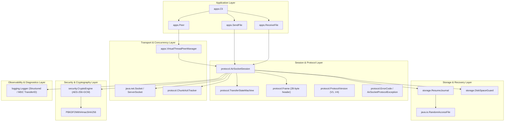
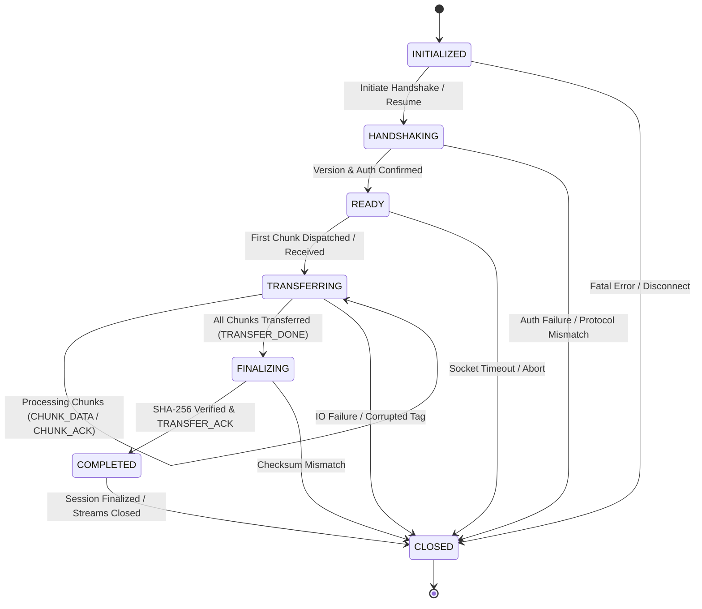
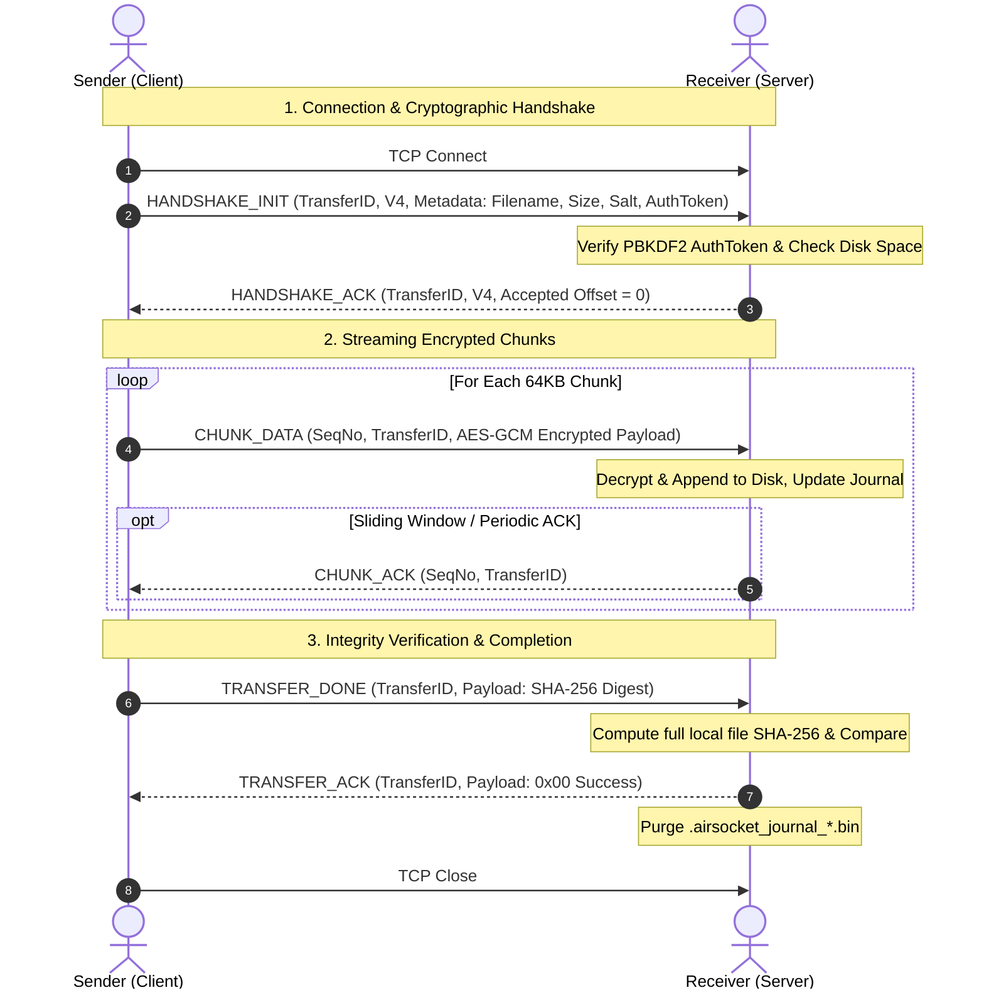

# AirSocket Architecture Specification

## 1. Executive Summary & Design Philosophy

**AirSocket** is a high-performance, resilient, zero-runtime-dependency peer-to-peer file transfer engine designed for modern enterprise and edge environments. Written exclusively against the standard Java runtime library (`java.base`, Java 21+), AirSocket achieves ultra-fast throughput, authenticated encryption, and deterministic resumption without relying on external third-party JARs.

### Core Architectural Pillars
1. **Zero External Runtime Dependencies**: Standard library only (`java.base`), zero transitive security vulnerabilities, zero dependency conflicts, single standalone executable fat JAR.
2. **Deterministic Resumption**: State machine-governed transfers backed by a binary crash journal (`.airsocket_journal_*.bin`) enabling zero-data-loss resume across sudden network partitions or process crashes.
3. **Defense-in-Depth Security**: AES-256-GCM authenticated encryption, PBKDF2WithHmacSHA256 key derivation with 100,000 iterations, 128-bit ephemeral salts, explicit transfer authentication tokens, and in-memory key wiping.
4. **Lightweight Virtual Thread Concurrency**: Powered by Java 21 Virtual Threads (`java.lang.Thread.ofVirtual()`), handling thousands of concurrent peer transfers with minimal memory overhead.
5. **Strict Binary Framing**: Fixed 28-byte headers, monotonic 64-bit sequence numbers, typed frames, bidirectional error signaling, and protocol version negotiation (V1–V4).

---

## 2. System Architecture & Component Hierarchy

---

## 3. Protocol State Machine

Every transfer is strictly governed by [`TransferStateMachine`](file:///home/amar/Documents/Projects/AirSocket/src/main/java/com/airsocket/protocol/TransferStateMachine.java). Transitions are monotonic and invalid transitions immediately terminate the connection with an `ILLEGAL_STATE` error frame.

### State Definitions
| State | Role | Valid Frame Types |
|---|---|---|
| `INITIALIZED` | Fresh session created | None (awaiting socket connection) |
| `HANDSHAKING` | Exchanging salt, token, version, transfer ID | `HANDSHAKE_INIT`, `HANDSHAKE_ACK`, `RESUME_REQ`, `RESUME_ACK` |
| `READY` | Auth successful, offset aligned | `CHUNK_DATA`, `CHUNK_ACK`, `PING`, `PONG` |
| `TRANSFERRING` | Streaming binary chunks | `CHUNK_DATA`, `CHUNK_ACK`, `PING`, `PONG`, `TRANSFER_DONE` |
| `FINALIZING` | Sender done; receiver verifying SHA-256 | `TRANSFER_DONE`, `TRANSFER_ACK` |
| `COMPLETED` | Both sides verified payload integrity | Session clean closure |
| `CLOSED` | Terminal state; resources freed | None (terminal) |

---

## 4. End-to-End Transfer Sequence (V4 Protocol)

---

## 5. Resume & Crash Recovery Mechanics

### Crash Invariants
- When network connections drop or machines crash, neither sender nor receiver retransmits the full file.
- The receiver maintains a dedicated binary crash journal on disk:
  `.airsocket_journal_<transferId>.bin`
- Binary journal layout:
  - Header: Magic `0x4153524A` (ASRJ), Journal Version `1`, Transfer ID (`UUID` 16 bytes)
  - Metadata: Total file size (8 bytes), Chunk size (4 bytes), Checksum algorithm (1 byte)
  - State: Completed byte offset (8 bytes), Last sequence number (8 bytes), Last modified timestamp (8 bytes)

### Recovery Workflow
1. Client reconnects and issues `RESUME_REQ` containing `TransferID` and expected file size.
2. Server reads journal matching `TransferID`. If missing or invalid, falls back to disk file length with integrity sanity checks.
3. Server responds with `RESUME_ACK` containing `Confirmed Offset`.
4. Client seeks `RandomAccessFile` directly to `Confirmed Offset` and resumes streaming from chunk `offset / chunkSize`.

---

## 6. Concurrency & Loom Virtual Threads

AirSocket utilizes Java 21 Virtual Threads (`Thread.ofVirtual()`) via [`VirtualThreadPeerManager`](file:///home/amar/Documents/Projects/AirSocket/src/main/java/com/airsocket/apps/VirtualThreadPeerManager.java):
- **Peer Mode**: Can simultaneously act as sender to multiple nodes and receiver from multiple nodes.
- **Resource Efficiency**: Virtual threads consume ~1KB memory overhead per active connection compared to ~1MB for platform threads.
- **Backpressure & Windowing**: Handled through synchronous blocking semantics on virtual threads without thread pool starvation.

---

## 7. Observability & Logging

- **Zero-Dependency Structured Logger**: Configurable via `--log-level` (`DEBUG`, `INFO`, `WARN`, `ERROR`, `TRACE`).
- **MDC Transfer Correlation**: Every log statement automatically captures the current `transferId` and virtual thread name (`transfer-xxxxxxxx`).
- **ANSI Color Formatting**: High-contrast, color-coded terminal output disabled automatically in non-interactive/CI environments.
